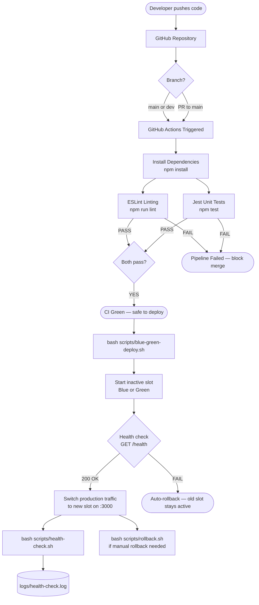
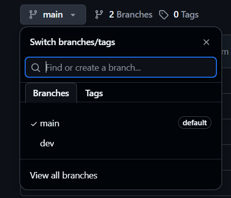
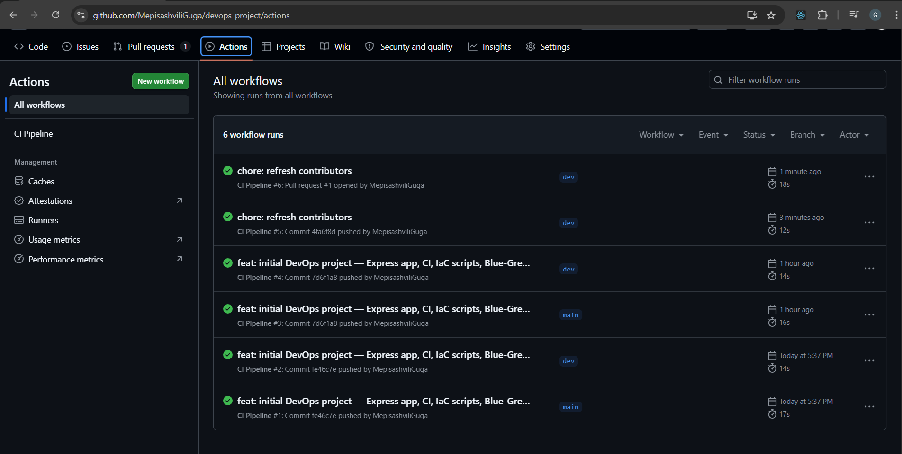
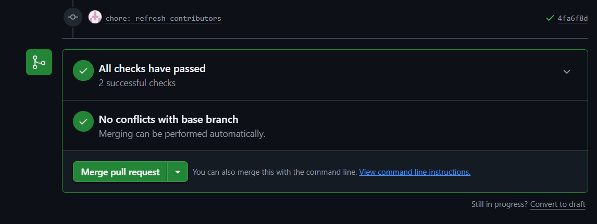

# DevOps CI/CD Project

A full DevOps pipeline demo: Node.js web app → GitHub Actions CI → Bash-powered IaC → Blue-Green CD → health monitoring.

---

## Tech Stack

| Layer | Tool |
|---|---|
| Web Application | Node.js 20 + Express 4 |
| Unit Testing | Jest 29 + Supertest |
| Linting | ESLint 8 |
| Version Control | Git (main + dev branches) |
| CI | GitHub Actions |
| IaC / CD | Bash scripts (Git Bash on Windows) |
| Deployment strategy | Blue-Green with automatic rollback |
| Monitoring | Bash health-check script + log file |

---

## Project Structure

```
devops-project/
├── app/
│   ├── server.js          # Express web application
│   ├── package.json
│   ├── .eslintrc.json
│   └── tests/
│       └── server.test.js # Jest unit tests
├── .github/
│   └── workflows/
│       └── ci.yml         # GitHub Actions CI pipeline
├── scripts/
│   ├── setup.sh           # IaC — single-command environment setup
│   ├── blue-green-deploy.sh
│   ├── rollback.sh
│   └── health-check.sh
├── .gitignore
└── README.md
```

---

## CI/CD Workflow Diagram



---

## Prerequisites

- **Node.js 20+** — https://nodejs.org/
- **Git for Windows** (includes Git Bash + curl) — https://git-scm.com/
- A **GitHub account** with an empty repository created

Verify in Git Bash:
```bash
node --version   # v20.x.x
npm --version    # 10.x.x
git --version    # git version 2.x
curl --version   # curl 8.x
```

---

## Step-by-Step Setup Guide

### Step 1 — Clone / initialise the repository

```bash
# In Git Bash, navigate to your project folder
cd ~/Desktop

# Initialise git and set up branches
git init devops-project
cd devops-project
git checkout -b main
```

Copy all project files into this folder, then:

```bash
git add .
git commit -m "feat: initial project structure with app, CI, and scripts"
```

### Step 2 — Create and push to GitHub

1. Go to **https://github.com/new** and create an empty repository (no README, no .gitignore).
2. Copy the repository URL (e.g. `https://github.com/your-username/devops-project.git`).

```bash
git remote add origin https://github.com/YOUR_USERNAME/devops-project.git
git push -u origin main
```

### Step 3 — Create the dev branch

```bash
git checkout -b dev
git push -u origin dev
```

**Screenshot 1 — GitHub Branches**



---

### Step 4 — IaC: Single-Command Environment Setup

In Git Bash from the project root:

```bash
bash scripts/setup.sh
```

This script:
- Checks Node.js, npm, curl, and git are installed
- Creates `logs/` and `scripts/pids/` directories
- Runs `npm install` inside `app/`
- Initialises deployment state files
- Creates `.env` with port configuration
- Runs the full test suite to verify everything works

**Screenshot 2 — IaC Setup Script**


---

### Step 5 — Run the application locally

```bash
cd app
npm start
```

Open **http://localhost:3000** in your browser.

**Screenshot 3 — Running Application**


Stop the server with `Ctrl+C` before continuing.

---

### Step 6 — Trigger the CI pipeline

Make a small change on `dev` to trigger CI:

```bash
git checkout dev
# Edit app/server.js — e.g., change the <title> text slightly
git add app/server.js
git commit -m "feat: update page title on dev branch"
git push origin dev
```

Then open a **Pull Request** from `dev` → `main` on GitHub:
1. Go to your repo → **Pull requests** → **New pull request**
2. Base: `main`, Compare: `dev`
3. Click **Create pull request**

The CI pipeline will trigger automatically.

**Screenshot 4 — CI Pipeline**



**Screenshot 5 — PR Checks Passed**



Merge the PR:
```bash
# After merging on GitHub
git checkout main
git pull origin main
```

---

### Step 7 — Blue-Green Deployment (CD)

First start an initial "blue" production instance:

```bash
# From project root in Git Bash
SLOT=blue APP_VERSION=1.0.0 PORT=3000 node app/server.js &
echo $! > scripts/pids/prod.pid
```

Open **http://localhost:3000** — you should see **Version: 1.0.0 | Slot: blue**.

Now deploy a new "green" version:

```bash
bash scripts/blue-green-deploy.sh 2.0.0
```

The script will:
1. Start the new `green` slot on port 3002
2. Health-check it at `http://localhost:3002/health`
3. Stop the old production process
4. Start `green` on port 3000
5. Verify the switchover

**Screenshot 6 — Blue-Green Deployment**


**Screenshot 7 — Green Slot Active**


---

### Step 8 — Rollback

```bash
bash scripts/rollback.sh
```

**Screenshot 8 — Rollback**


---

### Step 9 — Health Check Monitoring

Open a **new** Git Bash window and run:

```bash
bash scripts/health-check.sh 10
```

This checks every 10 seconds and logs to `logs/health-check.log`.

Leave it running for ~1 minute to collect several entries, then check the log:

```bash
cat logs/health-check.log
```

**Screenshot 9 — Health Check Monitor**


**Screenshot 10 — Health Check Log File**


---

## Application Endpoints

| Method | Endpoint | Description |
|---|---|---|
| GET | `/` | Home page with input form |
| GET | `/greet/:name` | Dynamic route — JSON greeting |
| POST | `/greet` | Form submission (redirects to `/greet/:name`) |
| GET | `/health` | Health check — returns JSON with status, version, slot |

---

## Running Tests Manually

```bash
cd app
npm test
```

Expected output: **12 tests passing** across 5 test suites.

```bash
npm run lint
```

Expected output: no ESLint errors.

---

## Port Reference

| Port | Purpose |
|---|---|
| 3000 | Production (always the live URL) |
| 3001 | Blue slot (inactive standby) |
| 3002 | Green slot (inactive standby) |

---

## Screenshots Summary

| # | Description |
|---|---|
| 1 | GitHub branch dropdown — main and dev |
| 2 | IaC setup.sh execution |
| 3 | Running application in browser |
| 4 | GitHub Actions CI pipeline passing |
| 5 | Pull Request checks passed |
| 6 | Blue-Green deployment output |
| 7 | Green slot active in browser |
| 8 | Rollback execution |
| 9 | Health check monitor |
| 10 | Health check log file |

---

## Troubleshooting

**Port already in use:**
```bash
# Find and kill process on a port (Git Bash)
netstat -ano | grep :3000
taskkill //PID <pid> //F
```

**npm command not found:**  
Make sure Node.js is installed and added to PATH. Restart Git Bash after installing.

**curl: command not found:**  
Use Git for Windows installer and ensure "Use Git and optional Unix tools from the Command Prompt" is selected.

**Health check returns 000:**  
The app is not running. Start it first:
```bash
cd app && npm start
```
